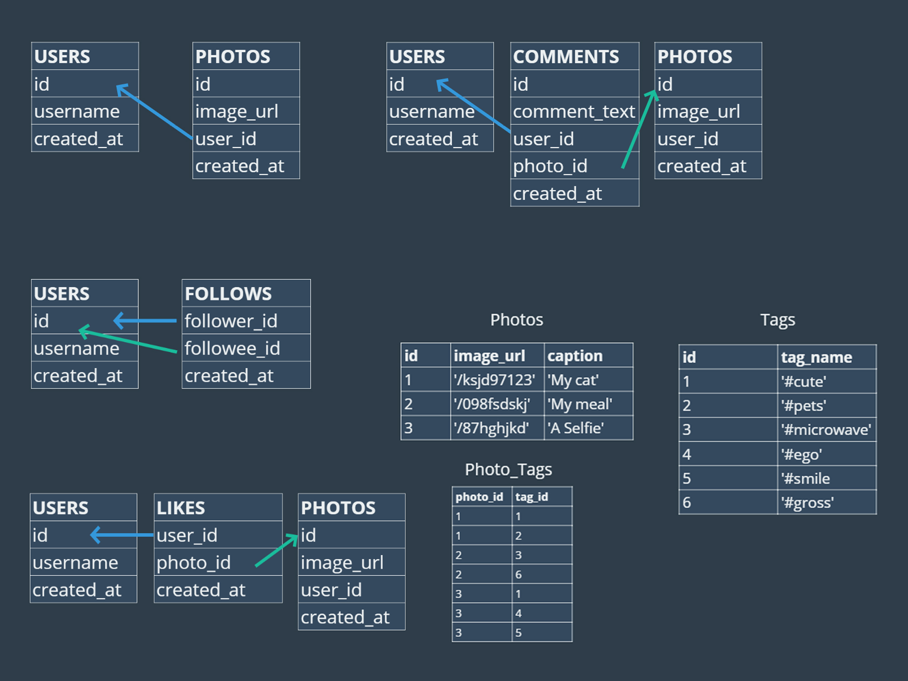
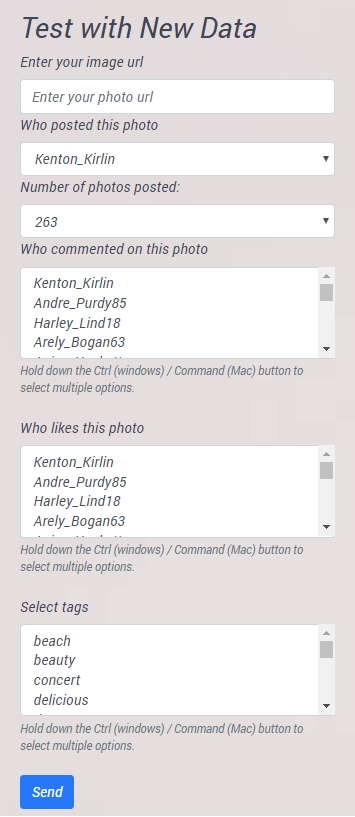

# Clone Instagram using Node JS and MySQL


_This image may not relate to this project at all. Source: www.appoets.com._ All images, data and R Script can be found [here](https://github.com/vuduong191/Gitbook/tree/master/resources/SQ01)

> C'mon! I can't clone Instagram. I dealt with MySQL a lot of time in my career, but when I knew how we can set up MySQL server on Node JS, I got very excited and went ahead to create this app.


I am aware that MySQL is not the best choice to create something like this app. However, as I am interested in the platform, I created it anyway. Many resources used in this app are taken from a MySQL course on Udemy by Colt Steele. He's a great instructor, and his cat is cute. By the way, I host this on Cloud9, but it requires monthly fee to keep its server open. Otherwise, it stops in like 2 hours of inactivity. I refused to pay, so the only way you can see this is to host it somewhere \(Cloud9 or Heroku, the latter is the cheaper choice\).

**However, here is the screenshot.**


## First, Data Schema



This schema is kindda straighforward, but credit belongs to Colt Steele anyway.

In this file - [fake\_instagram\_dataset.sql](https://github.com/vuduong191/Gitbook/tree/master/resources/SQ01/fake_instagram_dataset.sql), you can find the SQL syntax to create all tables and data for those tables. This again belongs to Colt Steele. But I created an [app](https://github.com/vuduong191/Gitbook/tree/master/resources/SQ01/data_generating_app.js) that adds real image URLs and some fake emails, using faker module. You need to run this after creating all the tables above to have a complete database.

## Masonry-like Photo Columns


I made this layout using Bootstrap.

**SQL syntax to get username, number of likes and number of counts for each photo ID**

```sql
SELECT photos.id, photos.image_url, users.username, photos.created_at, likecount, commentcount  FROM photos
LEFT JOIN (SELECT photo_id, COUNT(*) AS likecount FROM likes GROUP BY photo_id) AS liketable ON photos.id = liketable.photo_id
LEFT JOIN (SELECT photo_id, COUNT(*) AS commentcount FROM comments GROUP BY photo_id) AS commenttable ON photos.id = commenttable.photo_id
JOIN users ON photos.user_id = users.id
GROUP BY photos.id ORDER BY photos.created_at DESC;
```

**SQL syntax to get the list of tags in a presentable way**

```sql
SELECT photos.id, tags.tag_name 
FROM photos 
LEFT JOIN photo_tags ON photos.id = photo_tags.photo_id 
LEFT JOIN tags ON photo_tags.tag_id = tags.id 
ORDER BY photos.id;
```

When the result array is returned, I use a loop to create an array that contains all tags for each photo id, the index of the element + 1 equals the photo id.

```javascript
var photoTags = [];
for (var i=0;i<results[3].length;i++){
    if(photoTags[results[3][i].id-1]){ photoTags[results[3][i].id-1].push("#"+results[3][i].tag_name)}
    else {photoTags[results[3][i].id-1] = [" "];photoTags[results[3][i].id-1].push("#"+results[3][i].tag_name)}
};
```

## Left Column - Insert New Data



To populate all the entries for each variable, I use this in the EJS file. users and tagslist are variables that contain data read from MySQL queries.

```javascript
<label for="comment_user_id">Who commented on this photo</label>    
<select id="comment_user_id" name="input_comments" multiple class="form-control">
  <% for(var i=1; i < data+1; i++) { %>
      <option value='<%=i%>'><%=users[i-1].username%></option>
  <% } %>
</select>  
<label for="like_user_id">Who likes this photo </label>    
<select id="like_user_id" name="input_likes" multiple class="form-control">
    <% for(var i=1; i < data+1; i++) { %>
      <option value='<%=i%>'><%=users[i-1].username%></option>
    <% } %>
</select>

</br> 
<label for="tag_id">Select tags</label>    
<select id="tag_id" name="input_tags" multiple class="form-control">
    <% tagslist.forEach(function(tag) { %>
        <option value='<%= tag.id %>'><%= tag.tag_name %></option>
    <% }); %>
</select>
```

## Right Column - Description of data

**This is basically MySQL.**

Most commonly used hashtags:

```sql
SELECT tag_id, tag_name, COUNT(*) AS 'times' FROM photo_tags
JOIN tags ON photo_tags.tag_id=tags.id
GROUP BY tag_id
ORDER BY times DESC LIMIT 3;
```

Average number of posts per user:

```sql
SELECT AVG(post) as times
FROM ( 
    SELECT username, COUNT(photos.id) as post FROM users
    LEFT JOIN photos ON users.id=photos.user_id
    GROUP BY users.username 
) as t;
```

Average number of posts per user:

```sql
SELECT AVG(post) as times
FROM ( 
    SELECT username, COUNT(photos.id) as post FROM users
    LEFT JOIN photos ON users.id=photos.user_id
    GROUP BY users.username 
) as t;
```

Photo with the highes likes:

```sql
SELECT username, COUNT(likes.user_id) as 'no_of_likes', likes.photo_id, photos.image_url
FROM users
JOIN photos ON photos.user_id=users.id
JOIN likes ON photos.id=likes.photo_id
GROUP BY likes.photo_id 
ORDER BY no_of_likes DESC, photos.created_at DESC
LIMIT 1;
```

Inactive users:

```sql
SELECT username, IFNULL(photos.id,'Not posted yet') as status
FROM users
LEFT JOIN photos ON photos.user_id=users.id
WHERE photos.id IS NULL;
```

## When new data is inserted

Before, I had a baby rhino picture with the most likes. I will add a photo of Jennifer Aniston that has more likes. I like rhino, and it deserves awareness, but here is Jennifer Aniston.


