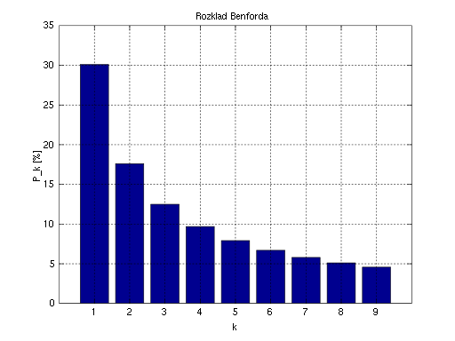

# Use Benford's Law To Detect Fraud - Python

## Benford's Law

_All images, data and Python Codes can be found_ [_here_](https://github.com/vuduong191/Gitbook/tree/master/resources/P02)

The theory of Benford’s Law is a non-intuitive fact that has been around since 1881 but wasn’t applied to financial data until 1989 by Mark Nigrini. The theory is that first digit of many measurements is not uniformly distributed, and low-digit numbers 1, 2, and 3 show up more frequently than higher numbers 4 through 9. The chart below represents the percentage of frequency the first digit should show up in a population:



While Benford’s Law should not be used as a final decision making tool by itself, it may prove to be a useful screening tool to indicate that a set of financial statements deserves a deeper analysis.

## Data Set

Credit Card Transactions in 2010 from governmental organizations. The data has been manipulated to serve the academic purpose of building a supervised fraud algorithm. The dataset has 96,753 records and 10 fields.

Also, we only consider P transactions and exclude transactions from FedEx. There’re 84,623 records in this set.

## Build a model

According to Benford's Law, low-digit numbers \(1,2\) acount for about 47.7%. We will group all transactions by Merchandise Number and calculate this ratio for each group. Ideally, these ratio is close to 1, so we will highlight the groups, in which this ratio is far from 1. We then do the same process for Card Number

Besides, we need to use a smoothing formula to drive the ratios closer to 1 in cases when the group is too small. For a group with a small size of members, the distribution is not representative. By making the ratios closer to 1 for such a group, we avoid highlighting these groups in the final step.

### Step 1: Get the first digit of transaction amounts.

Since the amount column is of dollar currency, by multiplying all values by 100, we’re confident that the first digit is non-zero. We doublechecked and confirmed that.

### Step 2: Define a function that measures unusualness and apply smoothing function

```python
def benfordstat(series, n_mid=15, c=3):
    count_low=sum(pd.to_numeric(series)<=2)
    count_all=len(series)
    r=count_low/count_all/0.477
    t=(count_all-n_mid)/c
    new_r=1+(r-1)/(1+np.exp(-t))
    stat=max(new_r, 1/new_r)
    return(stat)
```

'stat' in this code represent the level of unusualness, the higher the 'stat' the more alarming.

### Step 3: Group the data by Merchnum and Cardnum and apply the custom formula on ‘First\_Digit’ columns.

Below is the example for Cardnum

```python
#CARDNUM
CN_stat = DFwithoutFEDEX.groupby(['Cardnum'])['First_Digit'].apply(benfordstat).reset_index()
CN_stat.columns=['Cardnum', 'BenFordStat']
CN_stat.head(10)

Out[]:
Index   Cardnum      BenFordStat
0    5142110002    1.010214
1    5142110081    1.025562
2    5142110313    1.007152
3    5142110402    1.098099
4    5142110434    1.010214
5    5142110651    1.018316
6    5142110691    1.149137
7    5142110749    1.013124
8    5142110909    1.549873
9    5142111097    1.059953
```

### Step 5: Sort values by the unusualness scores and get 40 records with the highest scores.

```python
CN_stat.sort_values(by = 'BenFordStat', ascending = False).head(40).to_csv('Benford_Cardnum.csv')
MN_stat.sort_values(by = 'BenFordStat', ascending = False).head(40).to_csv('Benford_Merchnum.csv')
```

### Doublecheck

I notice this merchandizer with the highest unusualness score: infinity

```python
    Merchnum    BenFordStat
991808369338    inf
```

Now look at the details of this merchandizer

```text
Index    Recnum    Cardnum     Date          Amount    First_Digit
57    58    5142197563    2010-01-02    30.00    3
170    171    5142197563    2010-01-03    30.00    3
1129    1130    5142197563    2010-01-07    30.00    3
1734    1735    5142197563    2010-01-10    30.00    3
3706    3707    5142197563    2010-01-18    30.00    3
5266    5267    5142197563    2010-01-24    30.00    3
5949    5950    5142197563    2010-01-27    30.00    3
6403    6404    5142197563    2010-01-28    30.00    3
8258    8259    5142197563    2010-02-04    30.00    3
9478    9479    5142197563    2010-02-09    30.00    3
10380    10381    5142197563    2010-02-12    30.00    3
10433    10434    5142197563    2010-02-12    30.00    3
10447    10448    5142197563    2010-02-12    30.00    3
12630    12631    5142197563    2010-02-22    30.00    3
14398    14399    5142197563    2010-02-28    30.00    3
15915    15916    5142197563    2010-03-06    30.00    3
18351    18352    5142197563    2010-03-14    30.00    3
18562    18563    5142197563    2010-03-15    30.00    3
19000    19001    5142197563    2010-03-15    30.00    3
20414    20415    5142197563    2010-03-21    30.00    3
20558    20559    5142197563    2010-03-21    30.00    3
21663    21664    5142197563    2010-03-24    30.00    3
22015    22016    5142197563    2010-03-25    30.00    3
22376    22377    5142197563    2010-03-28    30.00    3
23904    23905    5142197563    2010-03-31    30.00    3
24263    24264    5142197563    2010-04-03    30.00    3
25342    25343    5142197563    2010-04-06    30.00    3
25854    25855    5142197563    2010-04-08    30.00    3
25857    25858    5142197563    2010-04-08    30.00    3
26136    26137    5142197563    2010-04-10    30.00    3
...
181 rows × 5 columns
```

You can tell how unusual it is. The merchandizer charged the same amount of money and charged only one card number. The transactions occured several times a day in some days. However, if a barbershop has only one customer, and that customer requests the same service every time, and he comes sometimes quite often, there's nothing fraudulent here. Again, this tool serves as a simple screening method, we need extra efforts to detect fraud with higher accuracy.

